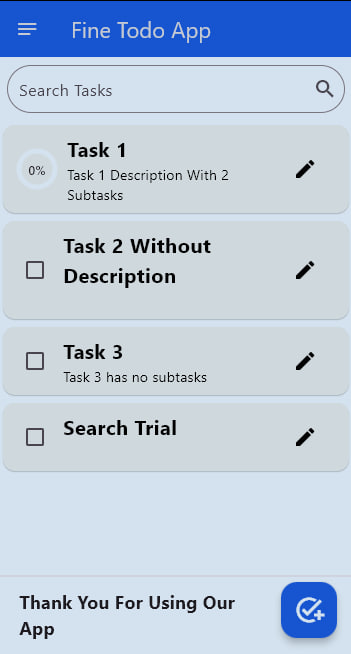
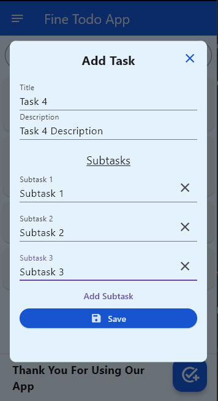
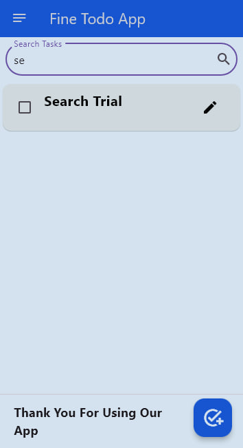

# Fine-Todo-App

A simple and intuitive task management app built with Flutter. This app allows users to create, edit, and delete tasks, as well as manage subtasks. It includes features like task completion tracking, search functionality, and a clean, user-friendly interface.

## Features

- **Add Tasks**: Create new tasks with a title, description, and optional subtasks.
- **Edit Tasks**: Modify existing tasks and their subtasks.
- **Delete Tasks**: Swipe to delete tasks with a confirmation dialog.
- **Subtasks**: Add and manage subtasks for each task.
- **Task Completion**: Mark tasks and subtasks as completed with a checkbox.
- **Progress Indicator**: Visual progress indicator for tasks with subtasks.
- **Search**: Search for tasks by title, description, or subtask title.
- **Local Storage**: Tasks are saved locally using `SharedPreferences`.
- **Responsive Design**: Works seamlessly on both mobile and tablet devices.

## Screenshots

| Home Screen | Add Task & Subtasks | Search Tasks
|-------------|--------------------|--------------- |
|  | | 

**Made with ❤️ by Fine Guy 21**
